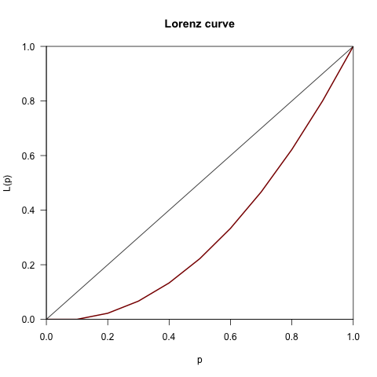
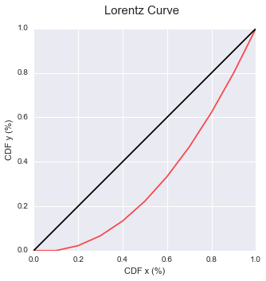

# ÍNDICE DE GINI Y CURVA DE LORENTZ 

Pequeño Script para calcular el índice de Gini y curva de Lorentz en python.

- AUTOR: [Maximiliano Greco](http://mmngreco.flavors.me/)
- FECHA: 17-10-2015
- CORREO: mmngreco@gmail.com

> ¡Las sugerencias son bien recibidas! :o)

## Requiere:

- matplotlib
- scipy
- numpy

## TO-DO

- Mejorar la eficiencia.
- Añadir método con frecuencias
- Añadir índice Reynold-Smolensky
- Añadir índice de Atkinson
- Añadir Gráfico en diferencias

# EJEMPLO


```python
import seaborn as sns
```


```python
%matplotlib inline
# para comparar con la salida de R
%load_ext rpy2.ipython 
```

Creamos una lista pero podemos usar una variable monetaria ya creada.


```python
x = list(range(10))
```

## EN R
###  A MODO DE COMPARACIÓN
### INDICE DE GINI
En R el Indice de Gini con el paquete __reldist__ nos da:


```python
%%R -i x -o g

require(reldist)
g = gini(x)
print(gini(x))
```


    [1] 0.3666667


### CURVA DE LORENTZ
La curva de Lorentz con el paquete de R __ineq__:


```python
%%R -i x
require(ineq)
plot(Lc(x), col='darkred', lwd=2)
```





## EN PYTHON

Importamos el script inequality.py


```python
import inequality as ineq
```

### INDICE DE GINI

Se calcula integrando por el método de los trapecios.


```python
ineq.gini(x)
```


    0.36666666666666681


### CURVA DE LORENTZ


```python
ineq.lorentz_curve(x)
```





### DISTRIBUCIONES ACUMULADAS DE X E Y

Si queremos las series de __x__ e __y__ usadas en las curva de Lorentz, basta con llamar al método `dist_lorentz`.


```python
import pandas as pd

lc_x, lc_y = ineq.dist_lorentz(x)

pd.DataFrame([lc_x, lc_y], index=['x', 'y']).T
```


<div>
<table border="1" class="dataframe">
  <thead>
    <tr style="text-align: right;">
      <th></th>
      <th>x</th>
      <th>y</th>
    </tr>
  </thead>
  <tbody>
    <tr>
      <th>0</th>
      <td>0.0</td>
      <td>0.000000</td>
    </tr>
    <tr>
      <th>1</th>
      <td>0.1</td>
      <td>0.000000</td>
    </tr>
    <tr>
      <th>2</th>
      <td>0.2</td>
      <td>0.022222</td>
    </tr>
    <tr>
      <th>3</th>
      <td>0.3</td>
      <td>0.066667</td>
    </tr>
    <tr>
      <th>4</th>
      <td>0.4</td>
      <td>0.133333</td>
    </tr>
    <tr>
      <th>5</th>
      <td>0.5</td>
      <td>0.222222</td>
    </tr>
    <tr>
      <th>6</th>
      <td>0.6</td>
      <td>0.333333</td>
    </tr>
    <tr>
      <th>7</th>
      <td>0.7</td>
      <td>0.466667</td>
    </tr>
    <tr>
      <th>8</th>
      <td>0.8</td>
      <td>0.622222</td>
    </tr>
    <tr>
      <th>9</th>
      <td>0.9</td>
      <td>0.800000</td>
    </tr>
    <tr>
      <th>10</th>
      <td>1.0</td>
      <td>1.000000</td>
    </tr>
  </tbody>
</table>
</div>


```python

```
